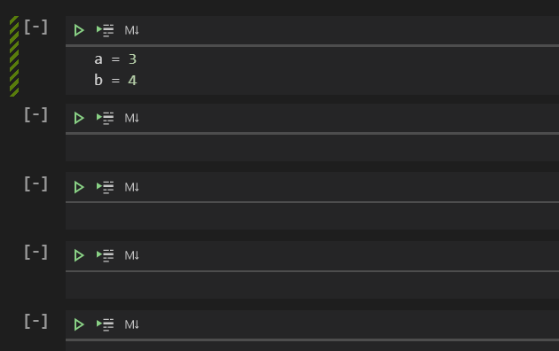
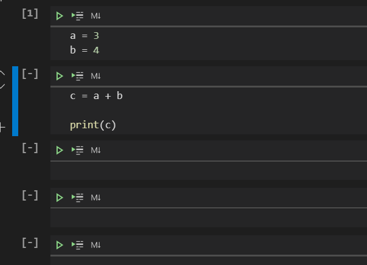

# Jupyter Notebooks

Visual Studio code (VSCode) is an IDE - Integrated Development Environment - to write computer code (it supports various programming languages other than Python as well).

VSCode supports a program called Jupyter. This program allows you to run something called a notebook. If you recall how you can run a live Python session from your terminal/command prompt, this is very much how a Jupyter notebook runs. 

To make your first notebook, you can press control + shift + p while in VSCode, and typing "create new blank jupyter notebook". In Jupyter notebooks, chunks of code is run in cells. Each cell is run when you have your cursor on the code in that cell and you press shift + enter, or control + enter. When you run a cell, statements in that cell block is run, and whatever variables you created are saved by the kernel (session). You can then use variables again in other cells, only after running this cell before. 

In the above image, some code is written in the first cell. The cursor is currently in the first cell.

After pressing shift + enter, the cell is run, and the next cell is selected. Notice that there is a number appearing in the square braces on the left upper corner of the cell. This shows that the cell has been run, and the number allows you to keep track of the sequence of running. 

Now, some code is written in the second cell that references some variables created in the first cell. This cell can then be run, as shown below.

To add a new cell above the current one, have your cursor selecting the whole cell by pressing escape, then press the 'a' key. To add a new cell below, press 'b' instead after selecting the whole cell. 

There are some shortcut buttons on the top. Rollover to discover what they do. When you hit the "restart kernel" button as shown above, the session is refreshed and whatever cells you run before needs to run again - the kernel now has 0 knowledge of the code you have run in other sessions. 

If I try to run the second cell *without running the first* after hitting refresh, I will get an error because the kernel does not know the variables a and b. 

# Exercises notebook

This notebook file exercises.ipynb comes with an accompanying Python file solutions.py. Save these two files in the same folder, and open exercises.ipynb with VSCode. 

Within the exercises.ipynb, the questions are written as comments in cells. You may edit out certain parts of the code (as per the instructions) and try to run these cells. When you have completed the instructions in the cells with questions, run it and then run the following cells after that to check if the answer is correct. 

The answers are in solutions.py, so do not open that file. Rather, only operate within exercises.ipynb and let the notebook check the answers for you. 