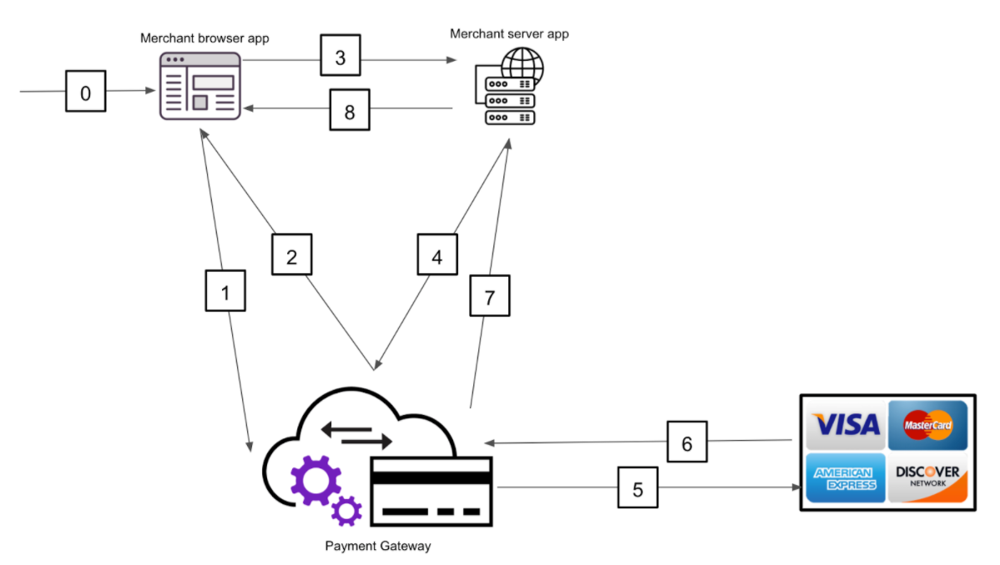

# RESTful API with OpenAPI and POSTman

Self-learning roadmap and materials for anyone to pick up fundamental concepts of RESTful API, learn how to design, and describe a REST API.

Join our learning community over at [CodeMap Facebook Group](https://www.facebook.com/groups/codemap)!

We will be using a credit card payment gateway as the subject for study, though simplified to reduce the payment domain specific scope of knowledge, hopefully will introduce just enough foundational concepts for API design while also give you a taste into how payment gateways work in tandem with payment providers like Visa, Master, etc.

## Pre-requisites

- An account on [SwaggerHub](https://app.swaggerhub.com/signup)
- [POSTman](https://www.postman.com/product/api-client/) API Client

## Theme Problem

For this module, we will be designing a card payment API that fulfills these below requirements:

- Able to create authentication tokens
- Able to create charges using these auth tokens
- Able to refund a captured charge
- Able to get information about an arbitrary charge
- Able to get a list of existing charges

## Understanding the requirements

Just like designing an application UI (user interface), designing its programming interface (API) requires good understanding about who users are, what they need, and how we can fulfill that.

### Key players

- Merchant: The one who own an online shop and trying to integrate with our payment gateway to accept credit card payments
- CreditCard Network: Visa/Master - Those who facilitate actual transactions and inform banks about money movement
- Payment Gateway: The role we’re playing who is building an API to help merchants:
  - Only integrate once instead of having to work with different card payment providers
  - Avoid expensive and troublesome PCI-DSS (Payment Card Industry Data Security Standard) annual audits
- **Notes**: In our RESTful API design, We don’t need to account in behind-the-scene processings that involve financial institutions and card holders as these are handled by The CreditCard Networks and are unbeknownst to our users (merchants)

### Mechanism

- **Step 0:** Customer initiates a credit card payment on merchant browser application (online store) by entering card details and clicking “Pay”
- **Step 1:** Card Details processing steps:
  - Card details are sent to our Payment Gateway because we’re PCI-DSS-compliant and able to handle credit card details
  - An authorization token is then created based on a combination of merchant’s public API key and card details
- **Step 2:** Our payment gateway sends an authorization token back to merchant browser app
- **Step 3:** Merchant browser app sends authorization token to their server app
- **Step 4:** Merchant server app create a charge by sending the authorization code (this is a stand-in for actual credit card number, as merchant server app might not be PCI-DSS-certified to handle credit card details) and authenticate itself with our payment gateway using an API key in the header
- **Step 5:** Our Payment Gateway retrieves card details based on the authorization token and submit a transaction request to corresponding credit card network
- **Step 6:** The credit card network confirms the transaction went through
- **Step 7:** Our payment gateway response with success to merchant server app
- **Step 8:** Merchant server app informs merchant browser app of successful payment

### Learning points from understanding the requirements

- Basic understanding a web application, frontend and backend, to be found [here](https://sagaratechnology.medium.com/the-fundamentals-of-front-end-and-back-end-development-5973ac0910cf)
- RESTful API:
  - What's an API? Find your answer [here](https://idratherbewriting.com/learnapidoc/docapis_what_is_a_rest_api.html) and [here](https://www.geeksforgeeks.org/what-is-web-api-and-why-we-use-it/).
  - HTTP Protocol:
    - [The basics](http://www.steves-internet-guide.com/http-basics/)
    - [An overview from Mozilla](https://developer.mozilla.org/en-US/docs/Web/HTTP/Overview)
  - Important data encoding for REST API's request bodies:
    - `application/json`:
      - [JSON specifications](https://www.json.org/json-en.html)
      - [What's JSON](https://www.w3schools.com/whatis/whatis_json.asp)
      - [How does JSON work?](https://www.copterlabs.com/json-what-it-is-how-it-works-how-to-use-it/)
    - `application/x-www-form-urlencoded`:
      - [json vs x-www-form-urlencoded](https://stackoverflow.com/questions/9870523/difference)
    - `multipart/form-data`:
      - [Specifications](https://tools.ietf.org/html/rfc2388)
      - [Browser implementation](https://stackoverflow.com/questions/8659808/how-does-http-file-upload-work)

## Realising the API Design

In this section, we will try to define an API specification document that's in compliant with OpenAPI 3.0 standard to describe our payment gateway API and at the same time creating a mock server for testing purpose (i.e. your merchants want to start integrating with your API before your engineers complete the implementation)

### Learning how to define and OpenAPI Specification

- Tools:
  - OpenAPI Standards 3.0:
    - http://spec.openapis.org/oas/v3.0.3
    - https://swagger.io/specification/
  - SwaggerHub:
    - https://swagger.io/tools/swaggerhub/
    - SwaggerHub Mock Server:
      - [Quick Intro](https://swagger.io/blog/api-development/the-smartbear-virtserver-integration/)
      - [Full Documentation](https://app.swaggerhub.com/help/integrations/api-auto-mocking)
  - [POSTman](https://www.postman.com/) - For writing and sending test requests against the mock server
- [API Design Conventions](https://www.vinaysahni.com/best-practices-for-a-pragmatic-restful-api)

### API Details at every step:

- Create authentication token:
  - Common authorization data:
    - Public API key
  - Request data:
    - Card number
    - Card CVV
    - Card expiry
  - Response scenarios:
    - Success:
      - Token
      - Masked card number
    - Tokenization error (invalid card details)
    - Server error
  - [Example solution](./credit-card-pg.yml#L14-L99)
- Create charges:
  - Common authorization data:
    - Secret api key
  - Request data:
    - Token
    - Amount
    - Currency
  - Response scenarios:
    - Success:
      - Charge ID
      - Masked card number
      - Amount
      - Currency
      - created_at timestamp for charge
    - Invalid charge:
      - Token already used
      - Not enough fund
      - Amount above max limit
    - Server error
  - [Example solution](./credit-card-pg.yml#L101-L171)
- Refund created charges:
  - Common auth data:
    - Secret api key
  - Request data:
    - Charge ID
  - Response scenarios:
    - Success:
      - Charge ID
      - Masked card number
      - Currency
      - created_at timestamp of charge
      - Refund fee amount
    - Charge not found error
    - Server error
  - [Example solution](./credit-card-pg.yml#L295-L360)
- Retrieve information about a charge:
  - Common auth data:
    - Secret api key
  - Request data:
    - Charge ID
  - Response scenarios:
    - Success:
      - Charge ID
      - Masked card number
      - Currency
      - created_at timestamp of charge
    - Charge not found error
    - Server error
  - [Example solution](./credit-card-pg.yml#L235-L294)
- Retrieve list of existing charges:
  - Common auth data:
    - Secret api key
  - Request data:
    - Sort by
    - Limit
    - Charge ID as cursor
  - Response scenarios:
    - Success:
      - Array of:
        - Charge ID
        - Masked card number
        - Currency
        - created_at timestamp of charge
    - Server error
  - [Example solution](./credit-card-pg.yml#L172-L233)

### Complete solution

Complete solution can be found [here](https://app.swaggerhub.com/apis/stanleynguyen/credit-card-gateway-api/1.0.0).
